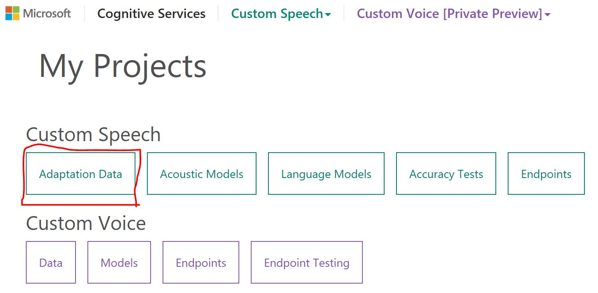
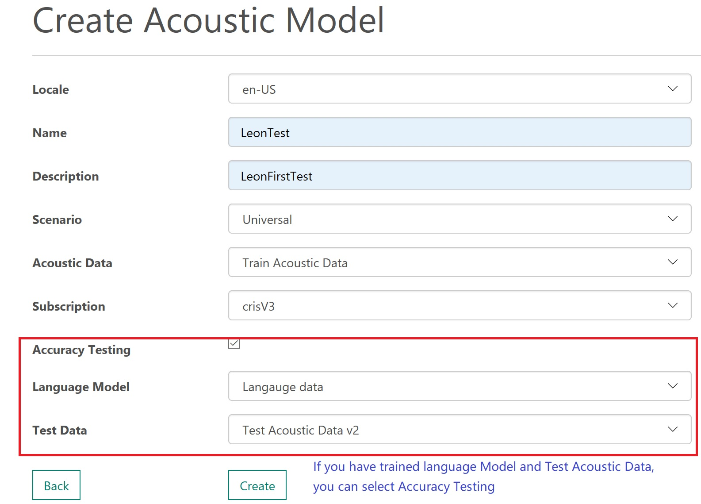

# 微软认知服务-自定义语音服务 (Custom Speech)：用自定义语音服务 (Custom Speech)打造您自己语音识别模型 

## 背景

在微软认知服务的Speech服务里，除了提供了传统的Speech to Text 和 Text To Speech，还提供了一个定制化的语音服务(<a href="https://cris.ai/Home/CustomSpeechCustom" target="_blank"> Custom Speech Service</a>)， 通过这个Custom Speech，您就可以根据您训练数据和场景，实现一个您自己的定制化STT 模型。 这样这个Customized Speech Module 可以更好地识别特殊的强调(tone), 说话环境，词语，特殊的发音。Custom Speech 是一个非常有用的服务。下面我们就一起看看如何使用Custom Speech 来建立自己的语音识别模型

## 先决条件

* 在这个例子，我们会用Visual stuido 2017 开发一个示例应用来调用和测试训练后的的Custom Speech Module。如果您没有VS2017， 请安装
* 请先体验一下Speech Service 的Demo <a href="https://azure.microsoft.com/zh-cn/services/cognitive-services/directory/speech/" target="_blank">点击这里</a>
* 团队至少有1个Speech Service账户。创建<a href="https://azure.microsoft.com/zh-cn/try/cognitive-services/my-apis/?api=speech-services" target="_blank">链接</a>。
* 选择一个调用REST API 和进行展示Client，可以是Web 页面，Mobile App，微信测试号，公众号或者Web App
* 为定制化语音服务（Custom Speech Service） 准备训练数据Dataset，比如Acoustic （Audio File），Language，Pronuciation。关于Custom Speech 训练用Dataset 可以参考<a href="https://docs.microsoft.com/en-us/azure/cognitive-services/speech-service/how-to-customize-speech-models" target="_blank">点击这里</a>

## 开始训练模型
首先，我们需要了解Custom Speech支持那些数据类型和根据场景，我们要准备那些数据。目前Custom Speech 支持三类的数据集类型

* Acoustic Datasets 声学模型  
比如，您想在嘈杂环境中更好地识别语音，则音频文件应由在嘈杂的环境中包括讲话人的声音。还有根据说话人的声调（tone）和词汇更好的识别，这样在训练的声音文件里需要包含说话对特殊语句和词汇的发音。
要为特定领域定制声学模型，需要收集语音数据。 该集合包括一组语音数据的音频文件，以及每个音频文件的转录的文本文件text file for transcriptions。 音频数据应该代表您想要识别的场景。
**请认真阅读Audio File 的要求 <a href="https://docs.microsoft.com/zh-cn/azure/cognitive-services/Speech-Service/how-to-customize-acoustic-models#audio-data-recommendations" target="_blank">声音文件要求</a>**
建立对应声音文件的脚本文件 Transcriptions for Audio dataset 请参考介绍： <a href="https://docs.microsoft.com/zh-cn/azure/cognitive-services/Speech-Service/how-to-customize-acoustic-models#transcriptions-for-the-audio-dataset" target="_blank">建立脚本文件</a>  

  这里我们先按照需求audio file 需求录制audio file。 这里大家一定注意 **格式要求**。重要的事情说三遍。 然后将wave file 存在Train Acoustic Data 目录里，然后zip 压缩目录生成Train Acoustic Data.zip. 可以将额外录制的Audio File 作为Test Acoustic Data. 之后针对每一个训练和测试的wave file，创建transcription 文件，声音文件里对应的脚本，请注意声音文件要少于60 secs，同时，在每个声音文件主要录制特别的场景和特定的词汇和强调。请不要在一个wave 文件里录制超过一句话。下面是一个例子

    speech01.wav  speech recognition is awesome   
    speech02.wav  the quick brown fox jumped all over the place      
    speech03.wav  the lazy dog was not amused

  我们在本地电脑上可以准备这样文件  
  

* Language Datasets
给出一些文字格式的例子，让模型更好地识别和转换文字。比如，英文的大小写，连字符，特定的格式。例如，用户说：fourteen northeast third drive，我们希望识别：14 NE 3rd Dr. 请将language 训练数据放入Language Data.txt 关于数据格式请参考<a href="https://docs.microsoft.com/zh-cn/azure/cognitive-services/Speech-Service/how-to-customize-language-model#prepare-the-data" target="_blank">prepare the language data</a>

* Pronunciation Datasets  
提供一些特殊文字，词汇的发音。在数据集里，需要制定如何发音。比如，McTwo 定义为：Mike Two. **请注意在Pronunciation.txt里特殊词汇和发音之间要用一个"Tab" 分隔开**

  McTWO mike two  
  McTWO mike tool  
  McTWO mark two  
  Hello McTWO hello mike two

关于数据类型可以参考 - <a href="https://docs.microsoft.com/en-us/azure/cognitive-services/speech-service/how-to-customize-speech-models" target="_blank">如何创建自定义语音模型</a> 和 <a href="https://docs.microsoft.com/zh-cn/azure/cognitive-services/Speech-Service/how-to-customize-language-model" target="_blank">如何创建自定义语言模型</a>了解更多

### 上传Dataset：

进入<a href="https://cris.ai" target="_blank"> Custom Speech Service Portal</a> 选择"Adaptation Data" 

将准备好的Acoustic data，Language 和 Pronunciation data 上传（Import）到相应的Dataset 里

在Import Acoustic Data 里将Transcriptions 和 Audio file 上传，然后，把Language 和 Pronunciation Data 上传。 **如果，您的场景中没有Acoustic 定制化寻求可以不用上传数据，可以根据您的场景选择相应的训练和测试数据**

### 创建模型(Models)：
您可以选择创建Acoustic Model 或者Language Model。从Custom Speech的下拉菜单里选择Acoustic Models，在页面里选择"Create New"，在这里您可以选择自己的训练Acoustic Data。在Accuracy Testing 选项里，如果您有训练好的Language Model和Test Acoustic Data，您可以勾选上，进行测试。 如果没有请忽略。

创建Language Model，从Custom Speech的下拉菜单里选择Language Models，在页面里选择"Create New"，在这里您可以选择自己的训练Language Data 和 Pronunciation Data。在Accuracy Testing 选项里，如果您有训练好的Acoustic Model和Test Acoustic Data，您可以勾选上，进行测试。 如果没有请忽略。

如果训练Status 是Failed， 请检查训练数据类型是否符合要求，比如，Audio File 是否wave mono，bitrate 等。您可以从"Accuracy Test Results"创建新的Accuracy Test，同时，也可以查询之前的测试结果。

### 部署模型生成 Endpoint：
当模型训练好后，就可以生成自己的Custom Speech Endpoints。从Custom Speech的下拉菜单里选择"Endpoints"，在页面里选择"Create New" 您可以将训练好的Acoustic Model 和 Language Model 都选上，也可以选择特定Acoustic 或者 Language Model。 这里"Universal" 代表通用（标准）Speech Model。
  

 部署完成以后，可以通过"Detail" 选项查看具体Endpoint ID，Subscription Key，REST API，WSS link 等。 通过API，您就可以直接调用您自己Custom Speech 模型。
  

 在Endpoint 页面里，您也可以直接上传一个wave 文件快速验证您的模型状态
  

### 在App里使用Custom Speech Model：
您的自定义语音模型训练好后，就可以集成在自己的应用里了。 您可以通过REST API， Websocket API 进行访问。 其实，Custom Speech Moduel API 比通用的Speech Service 就多了一个 Deployment ID (a.k.a Endpoint ID)，所以，您可以使用之前的Speech SDK，但是进行稍微的改动就行。 

这里我们用一个Windows App 的例子进行Custom Speech Model 在应用中的集成。 首先，我们将标准Speech 服务里的subscription key 输入到function - RecognitionWithMicrophoneAsync

    var factory = SpeechFactory.FromSubscription("YourSubscriptionKey", "YourServiceRegion");

然后，配置Custom Speech Moduel.在Function - RecognitionUsingCustomizedModelAsync 除了配置subscriptionKey 以外，还要配置DeploymentID，就是Endpoint ID

    // Replace with the CRIS deployment id of your customized model.
    recognizer.DeploymentId = "YourDeploymentId";

编译和运行后，输入1 是标准的Speech service， 输入4 是用Custom Speech Endpoint。下面是对于一个词Mctwo 不同的识别结果
 

这个Windows App 实例代码可以在目录crisWinAppDemo里找到，也可以访问<a href="https://github.com/Azure-Samples/cognitive-services-speech-sdk/tree/master/Windows/csharp_samples" target="_blank">link</a>

## 参考

**自定义语音识别服务 (Custom Speech Service)**

* 自定义语音识别服务 (Custom Speech Service) <a href="https://cris.ai/" target="_blank">Portal</a>
* 自定义语音识别服务 (Custom Speech Service)文档 <a href="https://docs.microsoft.com/zh-cn/azure/cognitive-services/speech-service/how-to-customize-speech-models" target="_blank">链接</a>
* 自定义语音识别服务(Custom Speech Service) Windows App 例子 <a href="https://github.com/Azure-Samples/cognitive-services-speech-sdk/tree/master/Windows/csharp_samples" target="_blank">链接</a>